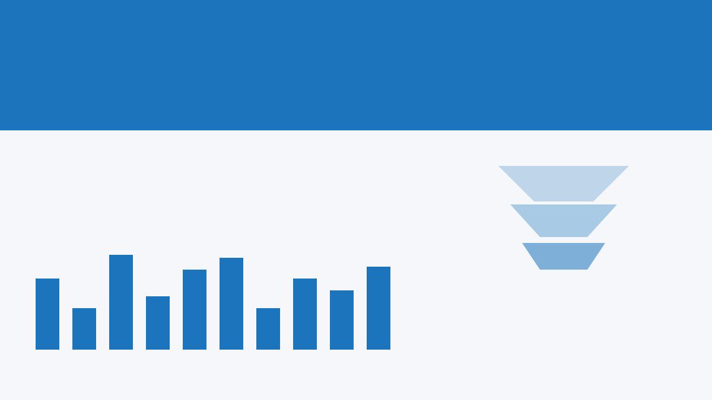
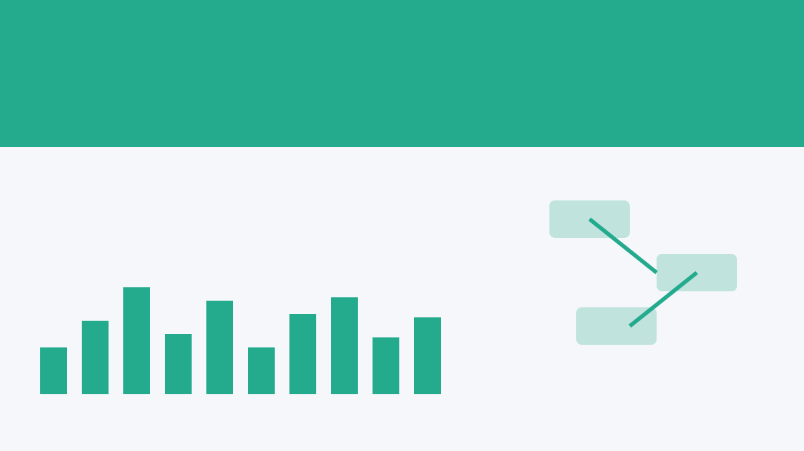
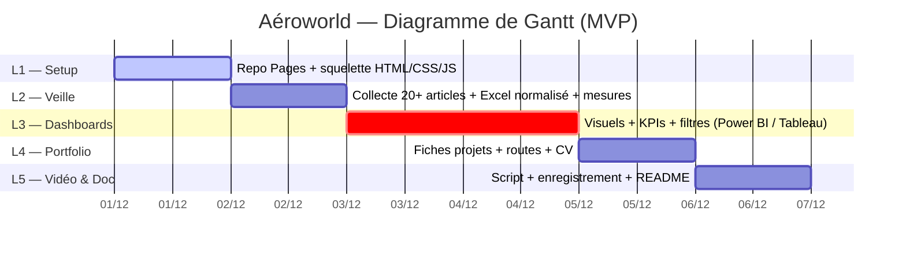

# Mathieu Bellini — Portfolio / CV

Site statique (HTML/CSS/JS) pour présenter mes projets **Data / BI Analyst**  
Stack : **Power BI · Tableau · Python (pandas) · KNIME · SQL**

**🌐 Live (préprod) :** https://materwwelon.github.io/mathieubellini.github.io/  
**📂 Repo :** ce dépôt

---

## 👀 Aperçu

<p align="center">
  <a href="https://materwwelon.github.io/mathieubellini.github.io/">
    
  </a>
</p>

---

## 🧭 Navigation

- **Accueil / Portfolio** → [`/data/index.html`](data/index.html)
- **Projets** → [`/data/projects.html`](data/projects.html)
- **CV & Livrables** → [`/data/cv.html`](data/cv.html)

> Le site utilise une feuille de style unique : [`/assets/style.css`](assets/style.css)

---

## 🎬 Vidéo de formation

- **Loom (démo / tutoriel)**  
  👉 https://www.loom.com/share/0c1bbddcb0a14fa798b59467d7be5648

---

## 📑 Documents

## 📚 Documentation

- [Documentation — Portfolio (Word)](assets/docs/Documentation.docx)

- **Analyse du besoin métier client — Aéroworld (Word)**  
  [`/assets/docs/Analyse_du_besoin_métier_client.docx`](assets/docs/Analyse_du_besoin_métier_client.docx)

- **Cahier des charges — Aéroworld (Word)**  
  [`/assets/docs/Cahier_des_charges.docx`](assets/docs/Cahier_des_charges.docx)

- **CV (PDF)**  
  [`/assets/docs/CV_Mathieu_Bellini.pdf`](assets/docs/CV_Mathieu_Bellini.pdf)

- [Carte mentale — Portfolio (PDF)](assets/docs/carte_mentale.pdf)

### Rapports Power BI (PBIX)

- [⬇️ Télécharger — Tableau de bord de veille (PBIX)](assets/pbix/Veille.pbix)
- [⬇️ Télécharger — Portfolio interactif (PBIX)](assets/pbix/Portfolio.pbix)


---

## 🧱 Structure du dépôt


- Les pages HTML de `/data` pointent vers les ressources avec des **chemins relatifs** `../assets/...`.
- Les miniatures des cartes projet sont dans `assets/img/` (ex. `p07.svg`…`p12.svg`).

---

## 🗂️ Projets (extraits)

| Miniature | Projet | Rôle / Année | Stack | Résumé |
|---|---|---|---|---|
|  | **Project Cost Alerts — Star Schema** | BI Analyst · 2025 | Power BI, DAX | Alerte écarts coûts (≥15%), refactor en schéma en étoile |
|  | **Executive Dashboard — Direction** | BI Analyst · 2025 | Power BI | Vue exécutive 3 pages, navigation par bookmarks |
|  | **Gender Equality Index — KNIME Workflow** | Data Analyst · 2025 | KNIME, Python | Rule Engine patterns, export CSV reproductible |
|  | **Water & Stability — 3 Tableau Views** | Data Viz · 2025 | Tableau | Monde → Continent → Pays + KPIs |
|  | **Portfolio Catalog — Project Cards** | BI / Front · 2025 | Power BI | Cartes réutilisables, liens vers dashboards |
|  | **Recruiter Path — 2-minute overview** | BI UX · 2025 | Power BI | Boutons + bookmarks, page KPI d’atterrissage |

> 🔗 Détails et cartes complètes : [`/data/projects.html`](data/projects.html)

---

## 🔁 Mettre à jour les projets

Deux options :

### A) Édition rapide (statique)
Modifier directement les cartes HTML dans [`/data/projects.html`](data/projects.html).

### B) Source JSON (dynamique)
Utiliser [`/data/projects.json`](data/projects.json) — le script embarqué remplace les cartes statiques si le JSON est chargé avec succès.

**Exemple d’entrée :**
```json
{
  "anchor": "p-cost-alerts",
  "title": "Project Cost Alerts — Star Schema",
  "year": "2025",
  "role": "BI Analyst",
  "stack": "Power BI, DAX",
  "img": "p07.svg",
  "summary": "Alerte écarts coûts (≥15%), refactor en schéma en étoile"
}
```

