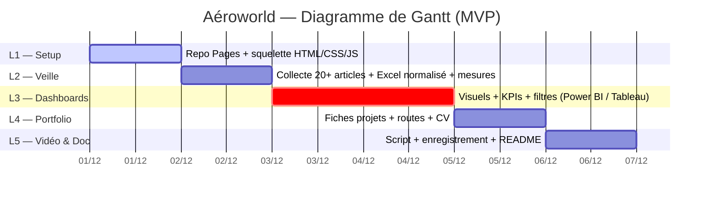

# Portfolio — Mathieu Bellini

Portfolio-CV statique (HTML/CSS/JS) pour GitHub Pages.

## Déploiement (2 min)

1. Créer le repo `mathieubellini.github.io` (ou n’importe quel nom).
2. Uploader tous les fichiers de ce dossier.
3. **Settings → Pages → Build and deployment**  
   - Source: `Deploy from a branch`  
   - Branch: `main` / folder `/ (root)`  
4. Attendre 1–2 min → site en ligne : `https://<ton_user>.github.io/`.

## Mettre à jour les projets

- Éditer `data/projects.json` (miniatures dans `assets/img/`).
- Les liens `link_demo` / `link_repo` peuvent pointer vers :
  - Power BI Service (rapport public)  
  - Tableau Public  
  - GitHub (code, notebooks)

## Personnalisation

- Styles → `assets/style.css`  
- Portrait → `assets/img/portrait.jpg`  
- CV PDF → `CV_Mathieu_Bellini.pdf`

## À faire plus tard (placeholders déjà prévus)

- Miniatures réelles des projets (`assets/img/p*.jpg`)  
- Liens démo/repo pour chaque projet  
- Liens de publication des dashboards (page CV, section Dashboards)
- Vidéos de formation (liens YouTube ou fichiers)

